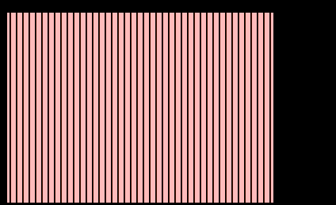
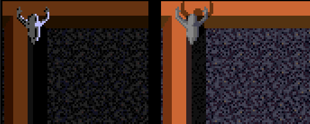
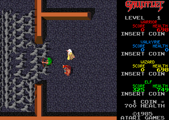
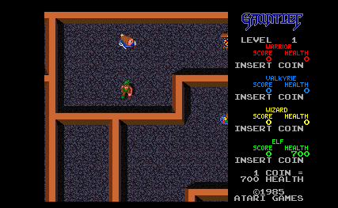
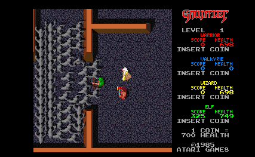
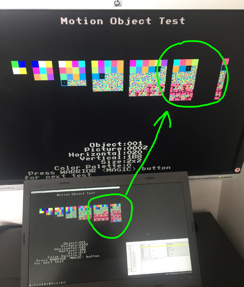
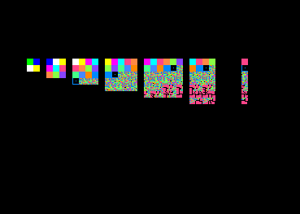

# Atari Gauntlet FPGA Arcade

## Hardware
Initially all screen shots here were generated from test bench output of what the video signal would look like if it was rendered on a monitor. To start with, the Video section of the arcade game was implemented and debugged (sheets 8 though 16 in the schematic). Because there was no CPU to run the game, for simulation purposes the video RAMs are initialized with data dumped from MAME so as to produce the relevant game screens.

Progress has been made and the game has been successfully run on a Pipistrello FPGA board with a custom add-on board which has a 2Mx16 SRAM chip rated at 10ns access time. This is needed because there is no space inside the FPGA to store all the game ROMs.

## Platform Information

The following collection of information serves as notes used during debugging.  

### Video Output

The game has a resolution of 336x240 pixels.

The video output is generated in `IRGB` format before being converted to `RGB` (sheet 16) so the total number of colors are 4 bits per color, plus a common 4 bit intensity for all colors for a total of 16 bits or 65536 colors.

The game uses the typical three layer video layout, `Text`, `Sprites` and `Background` with `Text` having the highest display priority (obscures sprites and playfield), `Sprites` having medium priority (only obscures background) and `Background` having the lowest priority. The schematic refers to the text layer as `AL` which seems to stand for Alphanumerics, the sprite layer is `MO` for Motion Objects and the background is `PF` for Play Field.

### Video Memory Layout

Table below borrowed from MAME source code. The video uses a total of 24KB RAM for the VRAM (video RAM) organized as three sections of 4Kb x 16 bits:
<pre>
Playfield
PF  900000-901FFF   R/W   xxxxxxxx xxxxxxxx   Playfield RAM (64x64 tiles)
                    R/W   x------- --------      (Horizontal flip)
                    R/W   -xxx---- --------      (Palette select)
                    R/W   ----xxxx xxxxxxxx      (Tile index)  

Motion Objects
MO  902000-9027FF   R/W   xxxxxxxx xxxxxxxx   Motion object RAM TILE
                    R/W   -xxxxxxx xxxxxxxx      (Tile index)  
MO  902800-902FFF   R/W   xxxxxxxx xxxxxxxx   Motion object RAM XPOS
                    R/W   xxxxxxxx x-------      (X position)
                    R/W   -------- ----xxxx      (Palette select)  
MO  903000-9037FF   R/W   xxxxxxxx xxxxxxxx   Motion object RAM YPOS
                    R/W   xxxxxxxx x-------      (Y position)
                    R/W   -------- -x------      (Horizontal flip)
                    R/W   -------- --xxx---      (Number of X tiles - 1)
                    R/W   -------- -----xxx      (Number of Y tiles - 1)  
MO  903800-903FFF   R/W   xxxxxxxx xxxxxxxx   Motion object RAM LINK
                    R/W   ------xx xxxxxxxx      (Link to next object)  
Spare Video
SP  904000-904FFF   R/W   xxxxxxxx xxxxxxxx   Spare video RAM  

Alphanumerics
AL  905000-905ED3   R/W   xxxxxxxx xxxxxxxx   Alphanumerics RAM (64x32 tiles)
                    R/W   x------- --------      (Opaque/transparent)
                    R/W   -xxxxx-- --------      (Palette select)
                    R/W   ------xx xxxxxxxx      (Tile index)
    905F6E          R/W   xxxxxxxx x-----xx   Playfield Y scroll/tile bank select
                    R/W   xxxxxxxx x-------      (Playfield Y scroll)
                    R/W   -------- ------xx      (Playfield tile bank select)
AL  905F80-905FBF   R/W   xxxxxxxx xxxxxxxx   
AL  905FC0-905FFF   R/W   xxxxxxxx xxxxxxxx   
</pre>
Additionally 2KB RAM are used for the CRAM (color palette RAM):
<pre>
AL  910000-9101FF   R/W   xxxxxxxx xxxxxxxx   Alphanumerics palette RAM (256 entries)
MO  910200-9103FF   R/W   xxxxxxxx xxxxxxxx   Motion object palette RAM (256 entries)
PL  910400-9105FF   R/W   xxxxxxxx xxxxxxxx   Playfield palette RAM (256 entries)
EX  910600-9107FF   R/W   xxxxxxxx xxxxxxxx   Extra palette RAM (256 entries)
                    R/W   xxxx---- --------      (Intensity)
                    R/W   ----xxxx --------      (Red)
                    R/W   -------- xxxx----      (Green)
                    R/W   -------- ----xxxx      (Blue)
</pre>

There are 42 visible text lines across and 30 down, each text character requires a word  
Top line starts at 905000 - 905053, remaining 22 words not visible on screen  
Next line starts at 905080 - 9050D3, remaining 22 words not visible on screen  
etc...  
Bottom line starts at 905E80 - 905ED3, remaining 22 words not visible on screen  

### Special Memory Locations

There are two special memory locations at 930000 and 905F6E that control overall MO and PF horizontal and vertical offset (scroll)

- 930000 = PF and MO horizontal scroll. Increasing values scrolls the playfield left. Any write to memory range 930XXX will work. The bottom 9 bits of the `WORD` written to 930000 will be latched by signal `/HSCRLD` into a 9 bit register formed by chips `9S` `6M` `7M` as well as latched into the internal register of custom chip `12K`, the `PFHS` (Play Field Horizontal Scroller). At game startup this is initialized to 0005.

- 905F6E = PF and MO vertical scroll. Increasing values scroll playfield up. This memory location is scanned each video frame and the top 9 bits are loaded into presettable counters `5J`,`5F`,`4F` when both `/VSYNC` and `/PFHST` are active (start of each video frame). The counters counts up from that value for each horizontal line. This effectively pushes an offset into VPOS via the adders `5D`, `5E`. Lowest 2 bits are also loaded into a counter at each start of frame and count up modulo 4 into a 2:4 decoder which selects graphic ROM chip selects `GCS0`..`GCS3`  

### Sprite Format  
Sprites are stored at memory range 902000-903FFF. A single sprite is defined by four words: a tile, xpos, ypos and link value stored at the same offset in four different memory regions (some additional attributes are also stored, see detailed memory map above).

The sprites form a linked list via the LINK memory region 903800-903FFF

The link to the next sprite is obtained by doubling the current LINK offset and adding it to LINK memory base 903800.

For example at game startup the initial screen has the sprite link list shown below based on initial sprite offset 0046. Doubling the offset, we get 8C and adding it to LINK base memory 903800 we get 90388C, then as per the table below each memory has a LINK offset pointing to the next sprite LINK address. Note that many tiles in the link list do not contain a visible sprite (value 0800) yet they are still part of the linked list, perhaps simply waiting for a valid sprite value to be stored at those addresses and the sprite then becomes visible.
<pre>
Memory 90388C 90389C 9038AA 9038B8 903978 90397A 90397C 90398C 903A1C 903A2C 903C38 903C3A 903C3C 903C7A 903D18 903D1A
Sprite   097E   0990   08FC   0AFC   1D42   1D48   1D52   1648   096C   0990   0800   0800   0800   09AB   0800   0800  
Memory 903D1C 903D1E 903D20 903D58 903D5A 903D5C 903D5E 903D60 903D7A 903D98 903D9A 903D9C 903D9E 903DA0 903DD8 903DDA
Sprite   0800   0800   0800   0800   0800   0800   0800   0800   0800   0800   0800   0800   0800   0800   0800   0800  
Memory 903DDC 903DDE 903DE0 903E18 903E1A 903E1C 903E1E 903E20 903E58 903E5A 903E5C 903E5E 903E60 903E98 903E9A 903E9C
Sprite   0800   0800   0800   0800   0800   0800   0800   0800   0800  0800    0800   0800   0800   0800   0800   0800  
Memory 903E9E 903EA0 903ED8 903EDA 903EDC 903EDE 903EE0 903F18 903F1A 903F1C 903F1E 903F20 903F58 903F5A 903F5C 903F5E
Sprite   0800   0800   0800   0800   0800   0800   0800   0800   0800   0800   0800   0800   0800   0800   0800   0800  
Memory 903F60 903F98 903F9A 903F9C 903F9E 903FA0 903FD8 903FDA 903FDC 903FDE 903FE0 903FFA 903800
Sprite   0800   0800   0800   0800   0800   0800   0800   0800   0800   0800   0800   09E1   0000
</pre>

The sprite link list does not appear to be circular, so the LINK register must be somehow initialized with the offset of the first sprite in the link list at the start of each horizontal scanline. It appears that the first memory location (index=0) does not contain a LINK to a valid sprite during gameplay so once that memory location is reached, the LINK register remains zeroed until it is loaded again with a valid index.

Memory region 905F80-905FFF seems to control sprite visibility as follows  
905F80 enables sprites on first 8 lines of screen 1..8  
905F82 enables sprites on  next 8 lines of screen 9..16  
...  
905FB8 enables sprites on  next 8 lines of screen 321..328  
905FBA enables sprites on  last 8 lines of screen 329..336  

To be determined  
905FC0  
..  
905FFE  

At each location, the word's top 6 bits seem to be unused and the word's bottom 10 bits (when doubled) is a pointer to a sprite offset (typically the first sprite in a linked list).

So for every word in the memory range 905F80-905FBA, if the word's bottom 10 bits point to a valid sprite, then if that sprite or any other sprites linked from it have y coordinates that fall within the screen range of 8 lines covered by that memory location, those portions of those sprites are visible on those lines on the screen.

From simulation, this memory range is scanned during each horizontal line, data from MO VRAM ends up on VRD then loaded on LINK register latch `8F`, `8J` on rising `RCLK` when `/LINK` signal is low.

## It's Alive!!!
After the initial translation of the schematic to RTL, the simulation produces the frame of video on the left but it's not the expected output as can be seen on the right from MAME:  
 

### Debugging the alphanumerics:
The top right corner under the Gauntlet logo, where the first text line should read "LEVEL   1", the L begins to be drawn but instead of drawing an L shape the display shows the 2 pixels of the top of the L replicated for all 8 lines after. All text characters exhibit this same behaviour.

Pixel data goes to GPC `APIX1`, `APIX0` from shifters `7P`, `7N` fed by `ROM 6P` driven by `VRD` bus through latches `4P`, `7R` on `4H` rising clock. `ROM 6P` address is `VRD9..0` registered, plus unregistered signals `4V`, `2V`, `1V`, `/4H`, address changes every 4 cycles.

Turns out `4V`, `2V`, `1V` were not being driven so `ROM 6P` was not being addressed properly and was not outputting enough new data to form proper characters. Connecting the additional signals properly produces a much more recognizable picture:  

Additionally GPC `I_D` bus connect order was wrong, so the colors were also reversed. Fixing that shows colors in the correct order:  

### Playfield debugging
The playfield shows pink stripes instead of the expected maze. Forcing the AL ROMs to return zero, makes the text on the right of the screen disappear. This reveals additional playfield that would normally be hidden under the text. Since AL was fixed earlier, the AL ROMs will be left disabled while troubleshooting the PF issue.

Adding debug code to the simulator to dump selected busses to a log file and debugging the GP bus address (ROM addresses), data out of ROMs and into SLAGS, reveals several mistakes such as unconnected signals, SLAGS selectors S0 S1 to the shifters were reversed, etc, so progressively the playfield becomes more and more visible.  
  
  
  

The raw data from the correctly functioning SLAGS can be seen below. This is an example of what the `SLAGS` `MO` shifter output dumped into a .ppm file looks like before it is turned into an index into the color palette.
  

And this is the corresponding `PF` shifters output. Since these values are intercepted straight from the SLAGS outputs before they hit the color palette, each value is written into the .ppm file three times (R=G=B) so as to form a grayscale image.
  

### CRAM Debugging
PF is now looking much better but the colors are wrong. Suspecting CRAM, palette indexing.  
  

CRAM is addressed by the 10 bit bus CRA from GPC. The top two bits of address selects CPAL as follows:  

- 0 = AL  
- 1 = MO  
- 2 = PF  
- 3 = Extra  

Top two bits have value of 2 so they correctly access PF CPAL, lower byte is an index into the PF CPAL.  

From MAME it is apparent that for the initial screen, the game only uses CPAL indexes 280-29F for PF as below. This CPAL section shows what each index value is used for, X is don't care/unused, F is floor tile, the rest are different types of wall pieces.  
<pre>
280: 0000 6631 9631 C631 F631 F643 F654 F876 -- X X X X X X F X
288: 8333 7223 A324 F334 C334 C445 E445 F445 -- wallshade F F F F F F F
290: F410 F010 F110 F322 B520 4531 F531 F731 -- X X X wallright X X walldown wallleft
298: FC63 F840 FD84 F335 F246 F158 F26A F37B -- walltop X X X X X X X
</pre>

Examination in the simulator shows the following discrepancies:  

- wallshade color index expected 288 observed 257  
- wallright color index expected 293 observed 24C  
- walldown  color index expected 296 observed 249  
- wallleft  color index expected 297 observed 248  
- walltop   color index expected 298 observed 247  

It appears that the pattern is the original value lower byte + x20 xor 0xff. This incorrect data comes from the GPC (Graphic Priority Control) chip `12M` which in turn receives it from PFHS (Play Field Horizontal Scroll) chip `12K`. Since many of the custom chips in this schematic are based on earlier Atari arcade versions implemented with discrete components, checking schematic `SP-277` for the Atari System 1 where this `PFHS` implementation is based on, shows there is a small 64 bit `74F189` RAM chip inside the `PFHS`. A mistake made was in assuming that the data that goes into the RAM chip comes out exactly the same, but upon reading the RAM datasheet it turns out the data coming out of RAM is the **complement** of the data going in! After inverting the outputs from the `PFHS` RAM chip the PF now shows correct colors:  

### Debugging Motion Objects
Sprites do not show on screen at all. When there are sprites on the screen, it seems `/VMATCH` asserts during sprite presence but, horizontal match doesn't so the `MATCH` signal is never asserted. It seems the VHDL implementation of `6S` F/F with both set and preset was incorrect, output `6S9` is never preset by `/VERTDL`, also `6S6` output is **inverted**, not just straight through. After inverting output `6S6` and fixing the async preset of F/F `6S` sprites now show (corrupted) on the top part of screen and they seem to repeat instead of just showing once. Further research shows that `MOHLB` (Motion Object Horizontal Line Buffer) had miscellaneous logic issues that needed correcting.

### More CRAM debugging
Just when the colors appeared to be OK, it became apparent that sprites like 0863 (ghost) show up with wrong colors. Investigating why an incorrect color palette is selected leads to discovering that CRA5, CRA7 outputs from 8U page 15 are stuck low because they were left unconnected and were not being driven. After connecting them to the appropriate drivers the colors now look correct. Below left is what it looked like before, right is what it looks like after the fix.  
  

### Debugging Motion Objects Overlap
Problem with sprite overlap, when sprites (like the ghosts) are overlapping, some minor corruption is visible, for example the shadow of the top ghost's arm is not obscuring the ghost underneath. Suspecting GPC (Graphic Priority Control) problem.  

Left: how it looks, Right: how it should look.  

In other places there is visible corruption where extra pixels appear.  
  

As opposed to how it looks in MAME  
  

Sprite tuples for two ghosts to replicate issue  
GH1  GH2  
0890 0890  
0202 0002  
F392 F392  
0001 0000  

CRAM address comes from 12M GPC Graphic Priority Control output. This is not a `GPC` problem, need to check `MOHLB`  
Exclude PF without recompiling simulation with following command:  
isim force add {/tb\_fpga\_gauntlet/uut/gauntlet\_inst/video\_inst/p\_12M/i\_p} 80 -radix hex  

<pre>
MPX to IRGB Sprite value mapping  
 D7 -> 8FFF Ghost arm light gray  
 D8 -> 6FFF Ghost arm medium gray  
 D9 -> 6FFF Ghost arm medium gray  
 DA -> 5EEF Ghost arm darker gray  
 DE -> 8C63 Ghost shadow brown  
 FF ->      Seethrough  
</pre>

`MOSR` bus input to `MOHLB` for ghost sprite, FF means transparent otherwise top 4 bits are D (1101) and select the palette, bottom 4 bits select the sprite color within the selected palette. Squinting, you can almost see the ghost pattern in the data below  
<pre>
FF FF FF FF DE FF FF FF FF FF FF FF FF FF FF FF FF FF FF DE FF FF FF FF  
FF FF FF DE DE FF FF FF FF FF FF FF FF FF FF FF FF FF FF DE DE FF FF FF  
FF FF FF DE DE FF FF FF FF FF FF FF FF FF FF FF FF FF FF DE DE FF FF FF  
FF D9 FF DE DE FF FF FF FF FF FF FF FF FF FF FF D9 FF FF DE DE FF FF FF  
D8 D9 FF DE DE FF FF FF FF FF FF DE DE DE FF FF D8 D9 FF DE DE FF FF FF  
D7 D9 D9 DE DE DE FF FF FF FF DE DE DE DE DE D8 D7 D9 FF DE DE FF FF FF  
D7 D9 FF DE DE DE DE FF FF FF DE DE DE DE DE FF D7 DA DE DE DE FF FF FF  
D7 D8 FF FF DE DE DE DE D8 D7 DA DE DE DE DE FF D8 DA DE DE FF FF FF FF  
D7 D8 DA FF FF DE DE D8 D7 D7 D9 DA DE DE DE DE D8 DA DE FF FF FF FF FF  
D8 D7 D9 DA FF FF DE D7 D7 D7 D8 DA DE DE DE D8 D9 DA FF FF FF FF FF FF  
FF D8 D7 D8 D9 DA FF D7 D7 D7 D8 DA DE DE D9 D9 DA FF FF FF FF FF FF FF  
FF FF D8 D7 D8 D9 D9 D7 D7 D7 D9 DA DA D9 DA DA FF FF FF FF FF FF FF FF  
FF FF FF D8 D7 D7 D8 D7 D7 D7 DA DA DA DA DA DE FF FF FF FF FF FF FF FF  
FF FF FF FF D8 D7 D7 D7 D7 D9 DA DA DA DA DE DE FF FF FF FF FF FF FF FF  
FF FF FF FF FF D9 D7 D7 D7 D7 D9 D9 DA DE DE DE FF FF FF FF FF FF FF FF  
FF FF FF FF FF FF D8 D7 D7 D7 D8 D9 DA DE DE DE FF FF FF FF FF FF FF FF  
FF FF FF FF FF FF D8 D7 D7 D7 D8 D9 DA DE DE DE FF FF FF FF FF FF FF FF  
FF FF FF FF FF FF D7 D7 D7 D7 D8 D9 DA DE DE FF FF FF FF FF FF FF FF FF  
FF FF FF FF FF FF D7 D7 D7 D7 D8 D9 DA DE DE FF FF FF FF FF FF FF FF FF  
FF FF FF FF FF FF D8 D7 D7 D7 D8 D9 DA FF FF FF FF FF FF FF FF FF FF FF  
FF FF FF FF FF FF FF D8 D7 D8 D9 DA DE FF FF FF FF FF FF FF FF FF FF FF  
FF FF FF FF FF FF FF D8 D7 D9 D9 DA FF FF FF FF FF FF FF FF FF FF FF FF  
FF FF FF FF FF FF FF FF D7 D9 FF FF FF FF FF FF FF FF FF FF FF FF FF FF  
FF FF FF FF FF FF FF FF D8 D9 FF FF FF FF FF FF FF FF FF FF FF FF FF FF  
</pre>

Since `MPX` output of MO Horizontal Line Buffer is not as expected, problem may be with `MOHLB`.  

Simplistic way of how `MOHLB` works:  
There are two 512B RAMs that alternately buffer a **single video line** of sprites. Focusing on just one of those buffers, if two sprites overlap, the first sprite in the linked list is written to the buffer, then the next sprite in the linked list is written to the buffer, etc. If the sprites overlap and the current value of the sprite is visible (not FF) then it overwrites the memory location (covers the pixel of the sprite below) but if the current value of the sprite is transparent (FF), then it is not written to RAM so the pixel of the sprite below remains unchanged and shows through.

<pre>
Higher Sprite Data (new data to RAM)    : D7 D9 FF DE DE DE DE FF FF FF DE DE DE DE DE FF D7 DA DE DE DE FF FF FF FF  
Lower Sprite Data (existing data in RAM): FF FF FF FF D7 D9 FF DE DE DE DE FF FF FF DE DE DE DE DE FF D7 DA DE DE DE  
Expected RAM Data                       : D7 D9 FF DE DE DE DE DE DE DE DE DE DE DE DE DE D7 DA DE DE DE DA DE DE DE  
Observed RAM Data                       : D7 D9 FF DE D7 D9 DE DE DE DE DE DE DE DE DE DE D7 DA DE DE DE DA DE DE DE  
</pre>

It seems the `MOHLB` works as designed, but the data presented to it is causing it to incorrectly overwrite earlier buffered data when it shouldn't. This feels like it's a side effect of forcing sprites to appear on screen by loading sprite offset 0 with sprite data. Possibly a side effect of the issue below so putting this on ice for now until problem below is resolved.  

### Debugging Motion Objects LINK register
Sprites only show when sprite LINK value at offset 0 (memory 903800) points to a valid sprite, otherwise no sprites show at all.  

Visible sprites at game start:  
<pre>
                                       Ypos 15..7
                                       HFlip 6
                      Xpos 15..7       XTiles 5..3
Sprite bits 14..0     Palette 3..0     YTiles 2..0      Link 9..0 (offset x2 + 902000)  
90208C=097E Food1     90288C=2E01      90308C=E812      90388C=004E
90209C=0999 Chest     90289C=6E01      90309C=E812      903978=00BE
90218C=1648 Hero      90298C=2E0F      90318C=C812      90397C=00C6
90221C=096C Food2     902A1C=6E01      90321C=B812  
Must latch in         Must latch in    Must latch in    Must latch in
3C3K on rising        4N 3N on rising  5C 5K on rising  8F 8J on rising
PICTDL                HORZDL           VERTDL           /LINK  

The latch signals come from MC1, MC0 decoded by 1:4 active low selector 8T. MC1, MC0 are generated by 1H, 2H, 4H, MATCH  
3 /LINK
2 VERTDL
1 HORZDL
0 PICTDL
</pre>

The problem as observed from simulation is this:  
If the word at 903800 contains 0400 (as per MAME simulation of game), the LINK register is loaded with the bottom 10 bits (all zero) from that memory location and therefore when it is used as a pointer into the MO VRAM, it points to offset 0 (memory 903800) so it is loaded again with zero and so on, so the LINK register is always zeroed and never finds any sprites to display.

If however as a test, the word at memory location 903800 is initialized with a value that points to an actual sprite's offset, then that value is loaded into the LINK register and the LINK register is used as an index into the MO VRAM LINK area to retrieve the next word which is used as an index to the next sprite and so on. ISE simulator confirms this, by loading the VRAM with an exact dump of the memory from MAME, then changing location 903800 from 0400 to 0046 (so it points to the first sprite offset) then the simulation indeed proceeds to display all sprites on the screen as expected. Note that this is a hack to force the display of sprites and not normal game behaviour.

To further examine the VRAM addressing, a dump of the VRD bus is sent to a log file together with the address accessed. Analysis of the log shows that at video frame 1, line 1 time offset 574515ns the screen vertical offset appears on the bus (905F6E=0080) and in the simulator it is verified that it is indeed loaded into counters `5J`, `5F`, `4F` as expected.  

A little later at 576755ns memory location 905F80 is accessed. From experiments with MAME it is apparent that during game play the memory region 905F80 onwards stores sprite index values for sprites that should appear on the screen and this is where the LINK register should be loaded from initially. Further in the log, address 905F80 appears on the `VRD` bus and has value 0046 which is the value of the index to the first valid sprite but instead of being loaded into the `LINK` register `8F`, `8J` on the rising edge of the master clock when `/LINK` is low, the simulator shows that the enable signal `/LINK` goes low just as the master clock rises, and therefore misses loading the value on the VRD bus into the LINK register. By the time the master clock rises again, the `VRD` bus has changed value. There are two possibilities, either the VRD bus is early and should be delayed or the `/LINK` signal is late and should arrive about a half a master clock earlier.  

The `/LINK` signal is generated by chip `8T` when both `MC1` `MC0` are high and gate signal is low. All those signals come from register `6U` which registers them on the rising master clock. Before reaching `6U` the signals come from the outputs of GAL `7U` which is not clocked.  

Further experiments in ISIM indicate that forcibly initializing the `LINK` register to 046 at the start of each horizontal line, makes the sprites appear as expected. The LINK register must be initialized not earlier than H counter = 004 and possibly as late as H counter = 1A0. Initializing LINK earlier than 004 does not display all sprites (skips the first sprite in linked list) and initializing `LINK` as late as 1A0 makes the leftmost sprites on screen appear but leaves no time for the rightmost sprites to be displayed. Once `LINK` is initialized with 046 it follows through the sprite link list from index to index until it reaches index 0 and remains there (since the game does not place sprites at index 0 and its link index points to back to itself = 0 ).  

During the game's initial startup screen, sprites should be visible during lines 42-62 (3187125 ns), 103-126 (7081365 ns) and 138-157 (9315765 ns)  

Gut feel at this stage is that everything works as designed and the fault may be due to `SYNGEN`. The Sync Generator custom chip is based on the discrete chip implementation from schematic SP-277 for Atari System I. The GAL chips `136032.102.e5` and `136032.103.f7` may contain equations that while suitable for System I, may have been changed or tweaked in the `SYNGEN` for Gauntlet.

Further analysing the schematic and trying to understand how sprites function, of particular note is signal `/NXL` generated by `SYNGEN`. This signal comes from GAL `136032.103.f7` which monitors the H horizontal counters and resets them when a particular count is reached, therefore when `/NXL` pulses low, it resets the H counters to zero (start of new horizontal video line). It is not totally clear how the signals `/NXL` and `/NXL*` from schematic `SP-277` correspond with Gauntlet schema `SP-284` in regards to how many master clock cycles one is delayed with respect to the other.  

Furthermore on sheet 9 of Gauntlet schema, the address selector chip `7S` has a direct override controlled by `/NXL` which causes the `VAS1` line to go low when `/NXL` is pulsed low once at the start of each horizontal line.  

<pre>
VRAM addressing

VAS1* VAS0* VRAM_ADDR
 0     0    PF 900000-901FFF
 0     1    MO 902000-903FFF
 1     0    AL 904000-905FFF
 1     1    - No VRAM selected

VAS1 VAS0 VRAM_ADDR_BUS
 0    0   from PF V and H counters
 0    1   from MC1/MC0 and LINK register 
 1    0   from V and H counters
 1    1   from CPU address bus
</pre>

Since `VAS1` and `VAS0` directly control which one of four buses is selected to make up the video RAM address lines, this seems like a very good candidate to force a particular address on the `VRAM` bus to cause `LINK` register initialization. Of note is that a delayed and inverted version of `/NXL` disables the address selector that controls the top 6 bits of of the `VRAM` address allowing the pullups to pull high forcing a particular range of addresses for one master clock cycle.  

So when `/NXL` is low it forces `VAS1` to be low, limiting the `VRAM` address selection to only two out of the four available busses. `VAS0` is then used to select one of those two buses. `VAS0` comes directly from `VAS0*` delayed one master clock and `VAS0*` is created from `1H`, `2H`, `4H` and `/NXL` by GAL `7U`, but we see from the equations of `7U` GAL that one of the terms is "`/NXL` AND `1H`", but because `/NXL` is always low when `1H` is low (they are in sync) then `/NXL` has no chance of affecting the result of that logical AND. This doesn't seem correct and in fact points to the root cause of this entire sprite problem which has taken many hours of simulation and head scratching. The `/NXL` signal is delayed one master clock cycle inside `SYNGEN` before it comes out, then delayed again by the `5T` register. This turns out to be one delay too many and by eliminating the delay inside `SYNGEN` the portion of the `/NXL` low signal lines up with the part where `1H` is high, so essentially `/NXL` can now mask `1H` and influence the output `VAS0*` which directly affects the VRAM address selection.

ISIM testing now shows that removing the `/NXL` delay inside `SYNGEN` makes the sprites appear without having to force `LINK` register loading!!! So as suspected timing of the `/NXL` signal was at the root of the problem.

Below is the initial screen at game startup from simulation. The reason the playfield on the left hand side looks a little different from MAME is because I forgot to initialize the playfield horizontal scroll register to 005 as MAME does, so the playfield is scrolled right 5 pixels compared to the MAME reference picture.  
  
Same screen from MAME for reference.  
  

Another simulation of a later game screen with lots of sprites visible. Again the playfield horizontal scroll register in the simulation has a slightly different value from MAME so the screen is shifted right by some number of pixels.
  

Compared to the same MAME screen for reference.  
  

## Debugging Commands

In MAME debug mode use ***w@930000=0005*** to write new horizontal scroll offsets, or ***w@905F6E=00CB*** for vertical scroll offsets

In ISIM to write to 930000 without recompiling simulation we can place a value on `VBD` then pulse `/HSCRLD` with the following commands. .

**restart;  
isim force add {/tb\_fpga\_gauntlet/uut/gauntlet\_inst/video\_inst/bus\_VBD} CB -radix hex -time 3 us -cancel 5 us;  
isim force add {/tb\_fpga\_gauntlet/uut/gauntlet\_inst/video\_inst/s\_HSCRLDn} 0 -radix bin -time 3 us -cancel 4 us;  
run 18ms;**  

MAME debug commands to follow the sprite link list from an initial index and dump the values. Set temp0 to initial index of interest then repeat the next two command as many times as necessary  

**temp0=0046**  

**temp1=w@(902000+temp0\*2); temp2=w@(902800+temp0\*2); temp3=w@(903000+temp0\*2); temp4=w@(903800+temp0\*2); temp0=w@(903800+temp0\*2)&3ff**  

**printf "\n%04X TILE=%04X\n%04X XPOS=%d, PSEL=%d\n%04X YPOS=%d, HSIZ=%d, VSIZ=%d\n%04X LINK=%04X (%04X)",temp1,temp1&7fff,temp2,temp2>>7,temp2&15,temp3,temp3>>7,(temp3>>3)&7,temp3&7,temp4,temp4&3ff,903800+(temp4&3ff)\*2**  

### Misc  

Flow of data with no CPU active should be  
<pre>
  +-->[VRAMS]--vrd bus-->[VROM]--ab bus-->[SLAGS]--MOSR/PFSR bus-->[PFHS]--pfx bus-->[GPC]--cra bus-->[CRAMS]--RGBI out bus-->[Video Out]
  |
  |
  +--vra--+-(3 --) [ma12..1 CPU address]
          |-(2 AL) [HV counters]<------------------------------- [SYNGEN]<--------------[CLOCK]
          |-(1 MO) [mc1,mc0,lnk9..0 from vrd on /link signal]
          +-(0 PF) [pfv from counters, pfh from PFHS]
              ^
              |
              +---[VS1* VS0* selectors from 7U PROM]
</pre>

When no RAMs are selected the bus `VRD` floats  

## Sound Section
<pre>
    ========================================================================
    SOUND CPU
    ========================================================================
    0000-0FFF   R/W   xxxxxxxx   Program RAM
    4000-FFFF   R     xxxxxxxx   Program ROM

    1000          W   xxxxxxxx   Sound response write
    1010        R     xxxxxxxx   Sound command read
    1020        R     ----xxxx   Coin inputs
                R     ----x---      (Coin 1)
                R     -----x--      (Coin 2)
                R     ------x-      (Coin 3)
                R     -------x      (Coin 4)
    1020          W   xxxxxxxx   Mixer control
                  W   xxx-----      (TMS5220 volume)
                  W   ---xx---      (POKEY volume)
                  W   -----xxx      (YM2151 volume)
    1030        R     xxxx----   Sound status read
                R     x-------      (Sound command buffer full)
                R     -x------      (Sound response buffer full)
                R     --x-----      (TMS5220 ready)
                R     ---x----      (Self test)

    1030          W   x-------   YM2151 reset
    1031          W   x-------   TMS5220 data strobe
    1032          W   x-------   TMS5220 reset
    1033          W   x-------   TMS5220 frequency
    1800-180F   R/W   xxxxxxxx   POKEY communications
    1810-1811   R/W   xxxxxxxx   YM2151 communications
    1820          W   xxxxxxxx   TMS5220 data latch
    1830        R/W   --------   IRQ acknowledge
    ========================================================================
    Interrupts:
        IRQ = timed interrupt
        NMI = latch on sound command
    ========================================================================
</pre>

<pre>
List of sounds:
0 Reset all sounds
1 Silent (Volume off)
2 Noisy (Volume on)
3 Silences sounds
4 Music Chip Test (YM)
5 Effects Chip Test (Pokey)
6 Silences sounds
7 Silences sounds
8 Speech Chip Test (TMS)

YM sounds
	09-65 Misc Effects
	47/48 start/stop alarm sound
	49/50 start/stop alarm sound
	51/52 start/stop alarm sound
	53/54 start/stop alarm sound
	66/67 start/stop long music
	68-71 long music different tempos
	72 fade out music 68-71
	73 melody
Pokey sounds
	74-80 effects
TMS sounds
	81-220 Speech Sounds

221 pokey vol off
222 pokey vol low
223 pokey vol med
224 pokey vol high
225
</pre>

Set DIP switch to service mode and advance to sound test, then from MAINCPU, write sound command as
w@803170=51

From MAINCPU, sound CPU reset should be
w@80312E=1
w@80312E=0

breakpoint 5787 reads 1010, x contains the sound to play

When AUDIOCPU is unused and it is reset then 1030=00 so from reset address 599e the condition doesn't match and CPU is stuck in infinite loop at 59A5  
When AUDIOCPU is used it is reset then 1030=80 so from reset address 599e the condition matches and it jumps to 4002, where it initializes stack and continues running  

IRQ FFFE 4187  
RST FFFC 599E  
NMI FFFA 5729  

bp 4187,1,{printf "IRQ"; g}  
bp 599E,1,{printf "RST"; g}  
bp 5729,1,{printf "NMI"; g}  
bp 578a,1,{printf "X=%x",X; g}  

Skip RAM and ROM checks, jmp 40a3  
audiocpu.md@402c=ea40a34c  

breakpoint after NMI on read of snd command  
bp 578a  
watchpoint on YM access  
wps 1810,2,rw,1,{printf "%X %X",wpaddr,wpdata; g}  

NMI disable  
audiocpu.mb@fffa=9c  

SYNGEN 7M16 in , H1 = 3M58 H2=1M78  
IRQ 17.15ms  

## Main CPU Section
After an 8 month break from this project, spring, summer and autumn has come and gone, it is now cold and dark, time to get some work done :) Used the TG68K softcore from MiSTer as the base for the main CPU core. Initial problem was that the softcore doesn't match the pins of the real 68K CPU, for example `/AS` is completely missing and also the timing of the `R/W` and `/UDS`, `/LDS` signals coming out of the softcore is very wide so the whole timing doesn't match a real 68K bus access. After some research, the way others deal with that is to implement a wrapper around the softcore with a state machine to create or activate the signals in such a way that it more closely resembles a 68K in timing.

With a first draft wrapper, initial success was observed in simulation as the CPU comes out of reset, fetches `SP` from address 000000 and `PC` from address 000004 then continues execution. Additinally success is observed jumping into and returning from subroutines, meaning the correct data is pushed into and popped off the stack (RAM). Also interrupts work as expected which should not be surprising since the stack is functional.

### Memory.. unused
An interesting observation, even though the schematic sheet 3 shows RAMs attached to the CPU at address 800000, they do not appear to be used. Instead the stack is initialized with 904F00 which falls in the `SPARE` video memory area which seems to be used as the CPU RAM. Tracking down a picture of a Gauntlet board, it shows places 11A, 11B, 12A, 12B fitted with empty sockets.

### CPU simulation
Observations from MAME indicate that on game powerup it is not until frame 77 that a picture starts to appear. This is far too long to simulate as it takes about 90 seconds per frame to simulate. Poking around MAME debugger it seems a good starting point is address 040000, which produces a stable game with first video picture appearing at frame 35, a saving of 42 frames (1 hour of simulation).

This is an animation of the first 2 seconds (120 frames) produced by running the simulation in ISIM for about 3 hours.
 

### What memory test?
Poking around in the debugger I discovered a bug in the original game ROMs. At game power on, as well as performing ROM checksums to ensure that the ROMs are valid, the game also performs a RAM "test", or at least it tries to.

At address 0636 is the start of a number of calls to subroutine 0A2C which is called with registers A1 and A2 initialized to the following memory ranges: 
<pre>
904000-904FFE Spare video RAM
910000-9107FE Palette RAM
900000-901FFE Playfield RAM
905000-905FFE Alphanumerics RAM
902000-903FFE Motion object RAM
</pre>

The idea is that the subroutine at 0A2C will go through every memory word in the range and fill the word first with 1's (8000, C000, E000, ..., FFFC, FFFE, FFFF) then with 0's (FFFF, 7FFF, 3FFF, ..., 0003, 0001, 0000) comparing that the data read from RAM is as expected.

The problem is that in the loop that compares the current address in A0 with the end address in A2, someone inserted a write to address 803100 (watchdog reset), so this messes up the carry flag and the branch back to 0B04 is never taken.

<pre>
000B1C: B1CA           cmpa.l  A2, A0
000B1E: 33C0 0080 3100 move.w  D0, $803100.l
000B24: 65DE           bcs     $b04
</pre>

This means that only the first word in each memory region is tested before the loop falls through. If you were to swap around the instructions at 0B1C and 0B1E the bug would be fixed and the entire RAM range would be tested.

### Oh MAME, how could you...

I don't have access to a real Gauntlet arcade board, so I used MAME as my reference. Imagine my surprise after I got the game going and it appeared to function fine, when I went into the game "service mode" and I see this. Some of the sprite squares on the right hand side are cut off, while in MAME they appear whole.

  

Immediate assumption was "MAME is correct" so there's a bug in my implementation whereupon I proceed to embarc on a very lengthy debug session in ISIM. The problem with simulations is that they're very very slow, so anything one can do to skip unnecessary game run time in simulation can shave literally hours of simulation time. Normally the game takes 12 seconds from bootup to come up and advance 9 test screens to get to the relevant sprite test screen. It takes 2-3 hours to simulate 2 seconds of game run time. Slight problem...  

The most efficient way to deal with this is spend 10-20 minutes in MAME debug mode and find a suitable patch to the ROMs that causes the game to boot up and just jump to the relevant code that displays the sprites. Then the simulation time is cut to 5 minutes as it only needs to render the first 2 or 3 frames of video. This is exactly the process here, the game ROM was patched with the following code that executes straight from reset.  

<pre>
0005E2: move    #$2700, SR ; disable interrupts
0005E6: movea.w #$5A36, a3 ; set parameter
0005EA: movea.w #$5A32, a4 ; set parameter
0005EE: jmp     $1BD6.w    ; jump to relevant sprite code
</pre>

The real game ROMs are not in fact touched, instead a small script is run every time MAME debug mode is entered that apply this patch over the ROM memory.  

<pre>
maincpu.md@5E6=367C5A36
maincpu.md@5EA=387C5A32
maincpu.md@5EE=4EF81BD6
</pre>

Armed with this ROM patch the investigation began and sure enough the simulator produced the relevant video frame in only a few minutes.  

  

Then it was a matter of following the signals backwards starting from the video output. After identifying the video line signal where the part of the sprites was missing, that data comes out of the color palette RAMs, which are driven by the Graphics Priority Chip `GPC` which apparently also outputs incomplete data. So the `GPC` is not at fault, tracing backwards, the `GPC` is driven by the two line buffers inside the Motion Object Horizonal Line Buffer chip `MOHLB`. Because the line buffers, buffer the video signal and output it one video line later, this introduces a delay, so in the simulation traces one must look to the time period of the previous video line to find the relevant data stored in the line buffers. Turns out this data is also incomplete, so the "fault" lies before the `MOHLB` which is driven by the outputs of the video ROMs.  

So the next step is to check what is driving the address bus of the video ROMs. This is where things become complicated, see sheet 10 of the schematic. There is a fairly complex piece of circuitry that involves horizontal and vertical sprite address coordinate latches that also add offsets to those coordinates via adders and generate "match" signals when a sprite position matches the current H and V position of the video counters rendering the picture. Additionally there is also circuitry on page 14 which is also related in terms of timing and control signals. Long story short, after many hours in the simulator trying to understand how sprites are rendered to the video screen, it became apparent that the "problem" was in fact on page 14.  

There is a PROM chip 4R and  a countdown counter 5R. The PROM chip address is driven with bits 8 though 4 of the sprite horizontal position, as well as three bits representing one of the 8 possible sprite sizes. Based on the sprite horizontal position and size, the output of the PROM loads countdown counter 5R with a certain value when signal `/NEWMO` is aserted (New Motion Object aka sprite). The counter then counts down and generates signal `/END` which terminates the display of the sprite on screen.  

It was now clear in the simulation that while the first few sprites on the screen were being drawn correctly, the last two sprites (large squares) were being terminated prematurely by the `/END` signal. Inspecting the contents of the 4R PROM, it has a repeating pattern of 1,3,5,7,9,B,D,F for most of its first half and zeroes for most of the last half. Each of those values represent one of the eight possible sprite sizes, except for the least significant bit, which when set indicates that a sprite is present and must be displayed. The other top three bits are loaded into the 5R countdown counter. Each set of 8 bytes in the PROM represent a 16 pixel horizontal line offset (because only bits 8 though 4 of sprites H position drive the PROM address, so bits 3 to 0 = 16 values are not evaluated). This means that as we move from address 0 in the PROM towards higher values, this represents lower H sprite coordinates (left of the screen) moving towards higher H coordinates (right of screen).  

As we arrive to the middle of the PROM (almost all the way right of the screen), the repeating pattern of of 1,3,5,7,9,B,D,F, changes to to 1,3,5,7,7,7,7,7 and then 1,3,3,3,3,3,3,3 meaning that the counter value for larger sprites is artificially reduced causing them to be cut off before being fully displayed because the 5R countdown counter is loaded with a smaller value and asserts /END earlier. Then most of the last half of the PROM has zeroes meaning that no sprites will ever be displayed after a certain H coordinate (too far right / off screen).  

So after wasting many hours analyzing this, it turns out there is nothing wrong, the FPGA implementation functions correctly and it is in fact MAME that is wrong, even though it seems to display "more correct" video output. As a test I filled the PROM entirely with the 1,3,5,7,9,B,D,F pattern and run a simulation since I knew now that would cause all sprites to be fully displayed regardless of H screen coordinate value. The simulation proved it:

  

Finally thanks to Colin Davies, who was kind enough to hook up his real Gauntlet arcade PCB and run a test for me, the following picture shows that the real arcade game also displays cut off sprites on the right hand side, so yeah... MAME is wrong.  

  

Just for completeness though, it's worth pointing out that during gameplay, the rightmost 1/4 of the screen is always taken up by text display with player stats, so no sprites will even be visible in that region of the screen, therefore this will never be a problem.  
