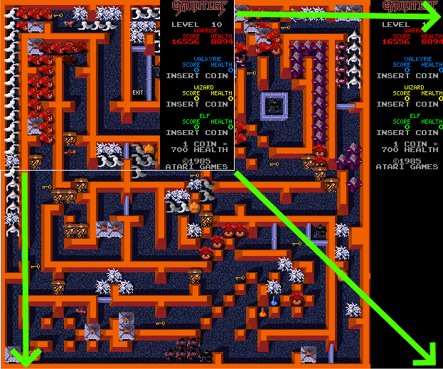
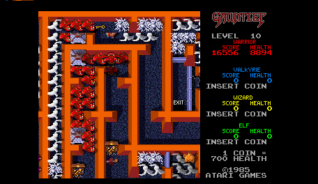
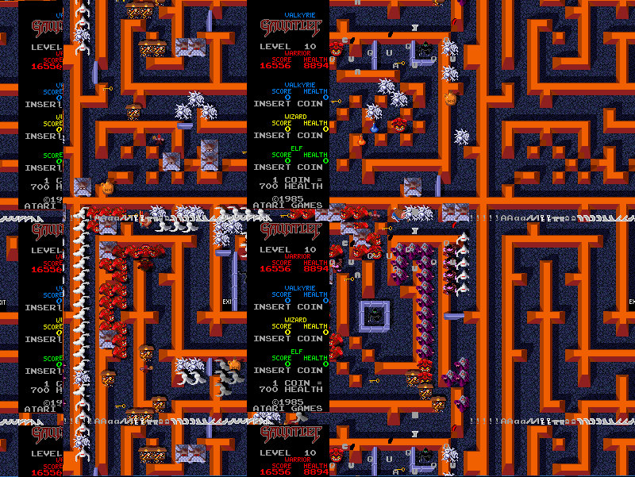
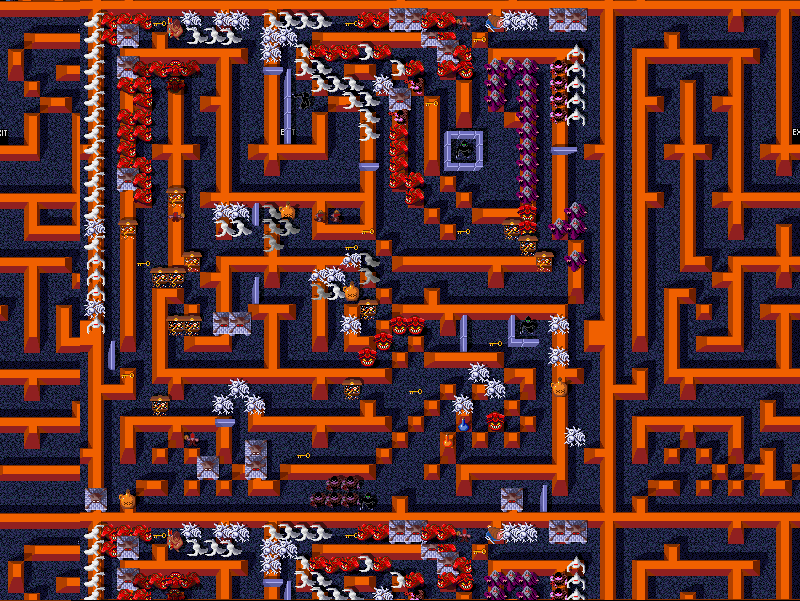
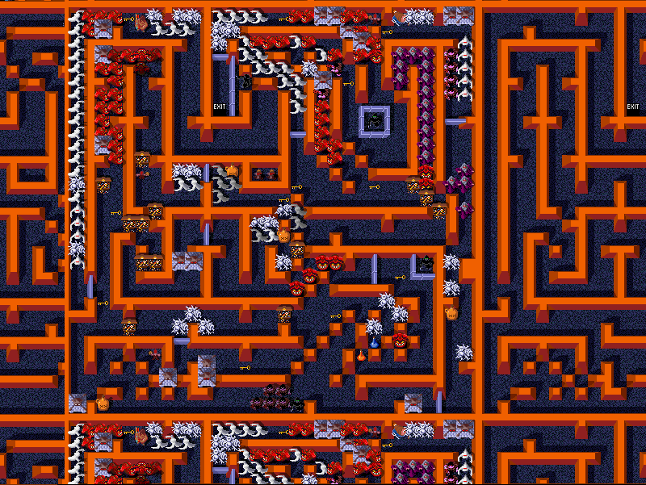
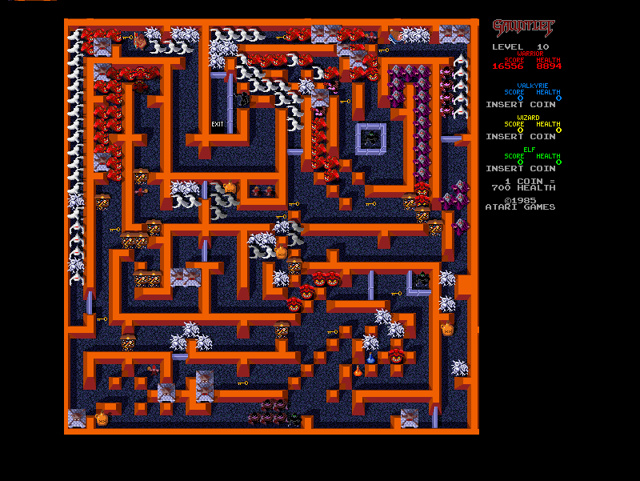

# SVGA resolution mod for FPGA Atari Gauntlet Arcade

## TL;DR
The playfield resolution is increased through tweaks to the video hardware, while maintaining the original game ROMs, with no software changes or patches. Below is a comparison of original playfield versus the expanded resolution playfield.    
  

## Back story
After turning the Gauntlet schematics into HDL code to run on a FPGA, while in the process of debugging the inner workings and making sure everything functions correctly, I stumbled across the fact that the game stores its entire playfield in RAM, including all the sprites, at their proper coordinates. It seems that every level consists of a playfield that is 512x512 pixels, but the game only displays on screen a 232x240 pixel window into this larger field.  

As the player moves around the playfield towards the edges of the visible field, this window moves around with the player so the player sprite remains in view. An idea started forming in my head, what if it was possible to see the entire field at once and do away with the small visible window and the scrolling. I sort of put that at the back of my mind while finishing the game debugging and releasing it for the MiSTer platform but when that was done, my curiosity had to be satisfied.  

As a starting point I started with a simulation of just the video circuitry with the video RAMs initialized to a game level that had a lot of sprites and walls. This initialization data was just a quick dump from MAME, basically play the game in MAME in debug mode until the required point then halt the game and save the video RAM memory and use that data to initialize the FPGA memories during simulation.  

With no changes, the simulation produces the expected output, a single game frame at the original resolution:  
  

Next came an analysis of the circuit diagram to figure out what could be done to increase the resolution. What resolution do we even need? Well, the playfield alone is 512x512 but there is another area to the right of the playfield with player stats that takes another 104 pixels so we need at least 616x512 therefore perhaps 800x600 would give us more than enough pixels.  

So how does one increase the video resolution? Well the chip we want to mess around with is SYNGEN, the sync generator. This chip contains the horizontal and vertical video counters and generates the H and V sync signals, H and V blanking as well as a few other timing signals used by the game internally. Since we need the H and V counters to count to 800 and 600 respectively, the first step is to extend those counters to 10 bits.  

Next we need to figure out the pixel clock. Currently the video pixel clock is 7.16MHz so if we leave that as is but with the increased resolution, then we run at 7.16M/800 = 8.948KHz line frequency and 7.16M/800/600 = 14.9Hz frame rate. This is far too low for any monitor, so if we double the pixel clock, we have 17.8Khz line frequency which while close enough to old school CGA monitors, is not exactly SVGA, so if we double the pixel clock again, we now have a pixel clock of 28.6MHz and a line frequency of 35.8KHz with a frame rate of 59.6 Hz. This is pretty good from a SVGA timing perspective, so now we know we have to run the video at x4 its original clock to meet the video timing requirements.  

Since we can calculate the timing signals based on the H and V counters, we can eliminate the timing PROM 5E completely from SYNGEN. By setting sl_NXL to reset at 799 and sl_VEOLn to reset at 599 we set the resolution to 800x600, as seen below. The sl_PFHSTn and sl_LMPDn must go low at H counter values 795 and 5 respectively, when lower bits of H counter have specific values and this was obtained by looking at the original code equations and simulation. The V and H blanking is left inactive for now and H and V sync values were adjusted experimentally to center the picture properly.  

<pre>
-- inits LINK register, marks start of each H line
sl_NXLn    <= '0' when to_integer(unsigned(slv_hcnt)) = 799 else '1';
-- resets vertical count
sl_VEOLn   <= '0' when to_integer(unsigned(slv_vcnt)) = 599 else '1';
-- loads PF H offset during /VSYNC and /VBLKN when 3H=1 and 4H = 0
sl_PFHSTn  <= '0' when to_integer(unsigned(slv_hcnt)) = 795 else '1';
-- enables /BUFCLR to clear HLB counters at start of each line when 4H 2H 1H = 1 0 1
sl_LMPDn   <= '0' when to_integer(unsigned(slv_hcnt)) =   5 else '1';

sl_VBLANKn <= '1';
sl_HBLANKn <= '1';

sl_VSYNCn  <= '0' when to_integer(unsigned(slv_vcnt)) > 558
                   and to_integer(unsigned(slv_vcnt)) < 561 else '1';
sl_HSYNCn  <= '0' when to_integer(unsigned(slv_hcnt)) > 697
                   and to_integer(unsigned(slv_hcnt)) < 729 else '1';

-- H, V counters
p_h_v_count : process
begin
	wait until rising_edge(I_CK);
	sl_4HDLn <= not slv_hcnt(2); -- 4H delayed x1 inverted
	O_4HDDn  <= sl_4HDLn;        -- 4H delayed x2 inverted

	if sl_NXLn = '0' then
		slv_hcnt <= (others=>'0');
		if sl_VEOLn = '0' then
			slv_vcnt <= (others=>'0');
		else
			slv_vcnt <= slv_vcnt + 1;
		end if;
	else
		slv_hcnt <= slv_hcnt + 1;
	end if;
end process;
</pre>

We also need to tweak PROM 4R which determines if a sprite is displayed on screen based on the H counter. If the sprite is too far right and falls in the range of the text with player stats, then it is inhibited even though the text info would cover the sprite anyway. The easiest thing to do is allow sprite display everywhere on the screen so we replace the PROM 4R with the simple equation:
<pre>
	slv_4R_data <= O_4R_ADDR(2 downto 0) & '1';
</pre>

The simulation produces this picture:  
  

While initially it may look a bit messy, the good news is that the video circuit can in fact produce a full representation of the internal playfield. It is apparent that the playfield is repeated due to the fact that it is only 512 pixels tall and wide but as the H and V counters pass value 511 the next value 512 indexes playfield coordinate 0 (rolls over) and so on, so the playfield pattern repeats. Also apparent is the fact that the text with the player stats is repeated due to a similar rollover situation. Finally as expected there are no borders since we disabled the blanking signals. Also the sprites seem a little misaligned relative to the playfield.  The reason for that is that there are video registers which can receive offsets from the CPU in order to scroll the playfield and sprites so these offset registers must be dealt with.  

First off, we temporarily disable the text with the player stats to clean up the image a bit. This is done by feeding a fixed value during cycle c2 which addresses a memory location that always contains a value that causes text to be transparent.  

<pre>
	slv_AL_offset <= x"F80"; -- F80 points to 905F00 = blank

	-- 8C, 8E, 8D selectors create video RAM address high
	-- 7L, 8L, 8K selectors create video RAM address low
	slv_VRAM <=
		slv_MA(12 downto 1)                          when slv_VAS = "11" else  -- c3
--		'1' & slv_V(7 downto 3) & slv_H(8 downto 3)  when slv_VAS = "10" else  -- c2
		slv_AL_offset                                when slv_VAS = "10" else  -- c2
		sl_MC1 & sl_MC0 & slv_LINK(9 downto  0)      when slv_VAS = "01" else  -- c1
		slv_PFH(8 downto 3) & slv_PFV(8 downto 3)    when slv_VAS = "00";      -- c0
</pre>

Then we disable the vertical offset register to disable the Y positioning of all screen elements.  

<pre>
	-- 5J, 5F, 4F counters
	p_5J_5F_4F : process
	begin
		wait until rising_edge(I_MCKR);
		if sl_H03 = '1' and sl_4H = '0' and sl_PFHSTn = '0' then
			if sl_VSYNCn = '0'  then
--				slv_PFV	<= slv_VRD( 1 downto 0) & '0' & slv_VRD(15 downto 7);  -- disable YPOS
				slv_PFV	<= slv_VRD( 1 downto 0) & "0000000000"; 
			elsif sl_VBLANKn = '1' then
				slv_PFV	<= slv_PFV + 1;
			end if;
		end if;
	end process;
</pre>

And also tweak the H position counters by adding a fixed negative value -7 so the X position of the elements lines up. This was determined experimentally using simulation.  

<pre>
	-- 5N, 5P adders and gates 4T
--	slv_HPOS <= slv_XPOS + (slv_adder_a + "000000001"); -- add 2's complement to XPOS
	slv_HPOS <= slv_XPOS + (slv_adder_a + "111111001"); -- add 2's complement to XPOS
</pre>

The simulation now shows a cleaner and better aligned picture, but the sprites still seem off:  
  

This is because the sprites are in fact properly aligned but the playfield is shifted. The culprit for this is another custom chip appropriately called PFHS (Play Field Horizontal Shift). All we have to do here is initialize the offset register of the PFHS with a fixed value determined experimentally.  

<pre>
	signal slv_10F : std_logic_vector(8 downto 0) := "000001111";
</pre>

And just in case, disable the signal from the CPU that loads H offsets into video registers:  

<pre>
	sl_HSCRLDn	<= '1'; --I_HSCRLDn;
</pre>

Now the sprites are aligned to the playfield.  
  

To deal with the misaligned text of the player stats, we need to offset it so it's to the right of the playfield. To also prevent it from displaying multiple times we can limit the range of H and V counter values for which the text is displayed. Experimantally we determine that this is the best placement during gameplay:  

<pre>
	slv_AL_offset <=
	('1' & slv_V(7 downto 3) & slv_H(8 downto 3)) + "000000011100" -- "VVVVVVHHHHHH" 
	when to_integer(unsigned(slv_H)) > 296 and to_integer(unsigned(slv_V)) < 240 else -- normal text
	x"81D" when to_integer(unsigned(slv_H)) > 522 and to_integer(unsigned(slv_V)) > 239 else -- 81D points to black
	x"F80"; -- F80 points to 905F00 transparent
</pre>

And enabling the blanking signals also with experimentally determined values from simulation:  

<pre>
	sl_VBLANKn <= '0' when to_integer(unsigned(slv_vcnt)) > 519 else '1'; --  V blanking
	sl_HBLANKn <= '0' when to_integer(unsigned(slv_hcnt)) <  10  or to_integer(unsigned(slv_hcnt)) > 632 else '1'; -- H blanking left/right
</pre>

The final picture looks like this which is perfect during gameplay:  
  

Note: During the attract screen when game information and instructions are shown, the offset text no longer aligns with the relevant portion of the playfield so the sprites displayed next to the text don't match the text information. This is not a problem during gameplay and only shows up when the game is idle with no coin-up and there doesn't seem to be an easy fix for that.  

## Finalizing the changes

Well now the video is overclocked to x4 its original speed and it does in fact display a SVGA-ish picture of the entire playfield. Some would say this spoils all the fun of the game, since now one can see the entire layout of the field, all the food items, treasures, enemies, exits. You can even see the thief coming a mile away so you can sniper him beffore he steals from you. On the other hand this also gives an entirely fresh dimension to the game and might inject new life into it for old hard core players, maybe some will find it fun to play it like this.

There is one final problem to overcome. The rest of the circuit still runs at the original clock frequencies and these must not be changed or they will affect the game playing speed and even the tones and rate of the sounds and music. But leaving those parts of the circuit at their original frequencies introduces a problem at the digital level with timing because of crossing clock domains. Signals no longer synchronize as they should. To make matters worse, the 68010 processor which runs at 7.16MHz uses part of the video RAM which runs at 28.6MHz for its stack and working memory. As suspected, synthesizing the core and running in on a FPGA results in failure, the game just doesn't run.  

In order to address the clock domain crossing, one solution is to run all the circuits at 28.6MHz then send a "clock enable" to the various parts that must run slower. For example sending a clock enable that only enables 1 out of every 4 clock pulses, effectively runs these parts of the circuit at 1/4 of the 28.6MHz clock, so basically at the original 7.16MHz frequency while also avoiding timing synchronization issues. Similarly clock enables are distributed to the audio section to make everything run at the original speed even though they are clocked by the main 28.6MHz clock.

The video section of the circuit also provides some timing signals 1H, 2H and 32V which are tied to the H and V counters. But since these counters now run from a x4 clock, these signals must be reconnected to preserve their original timing, 1H is now sourced from 4H and 2H is sourced by 8H. Unfortunately 32V is not as easy to remap. It is used only in the audio section to trigger an interrupt in the audio processor every 4ms which determines the speed at which the sounds play. So in order to preserve the timing we re-generate the 32V signal as follows:

<pre>
	O_32V <= -- replicate 4ms period of 32V, used for audio timing
		'1' when
		(to_integer(unsigned(slv_V)) >  72 and to_integer(unsigned(slv_V)) < 146) or
		(to_integer(unsigned(slv_V)) > 220 and to_integer(unsigned(slv_V)) < 294) or
		(to_integer(unsigned(slv_V)) > 366 and to_integer(unsigned(slv_V)) < 430) or
		(to_integer(unsigned(slv_V)) > 512 and to_integer(unsigned(slv_V)) < 586)
		else '0';
</pre>

The modified VHDL files that make the game run at SVGA resolution are in this folder. Also a precompiled .rbf file is provided here for the MiSTer FPGA platform so curious souls can experience this mod to the game.  

