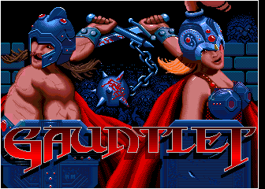

# Atari Gauntlet FPGA Arcade

## About
This is an FPGA implementation of Atari's arcade game "Gauntlet" from 1985, based on the SP-284 schematic circuit diagram.

Here is a youtube video of the current status, click on picture below:  

Additional video of FPGA running Gauntlet II ROMs

The game is mostly functional right now, can coin up and start game, known problems are as follows:

* The TMS5220 speech synth is not implemented
* Audio mixing is not ideal, sound quality needs improvement.
* Game EPROM is implemented as RAM so game settings are lost on power off.
* Some game ROMs are stored external to FPGA, multiplexing may need improvement.
* Only player 1 controls are connected (minor).
