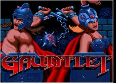

# Atari Gauntlet FPGA Arcade

## About
This is an FPGA implementation of Atari's arcade game "Gauntlet" from 1985, based on the SP-284 schematic circuit diagram.  

On a [Pipistrello](http://pipistrello.saanlima.com/index.php?title=Welcome_to_Pipistrello) FPGA board with a [SRAM expansion](https://oshpark.com/profiles/d18c7db) daughterboard it successfully runs all three games Gauntlet, Gauntlet II and Vindicators II that run on the original arcade. All sounds are implemeted, Pokey, YM2151 and TMS5220 Voice Synthesis Processor (see my [TMS5220 repository](https://github.com/d18c7db/TMS5220_FPGA) for more details on the VSP).  

  

The videos below show some of the problems encountered earlier in the development.  

Youtube video of Gauntlet:  

Additional video of FPGA running Gauntlet II ROMs  

The implementation is functional right now, can coin up and start game, known problems are as follows:

* Game EPROM is implemented as RAM so game settings are lost on power off.

## MiSTer Install
This repository follows the standard folder structure for distributing MiSTer files.

ROMs are not included so in order to use this arcade, you need to provide the correct game ROM.

To simplify the process .mra files are provided in the releases folder, that specify the required ROMs with checksums. The .zip filename refers to the corresponding ROM file of the MAME project.

Please refer to https://github.com/MiSTer-devel/Main_MiSTer/wiki/Arcade-Roms for information on how to setup and use the environment.

Quickreference for folders and file placement:

/_Arcade/<game name>.mra  
/_Arcade/cores/<game name>.rbf  
/_Arcade/mame/<mame rom>.zip  

Gauntlet currently supports up to 4 joysticks for 4 players. (up, down, left, right, fire, start/magic, coin) MAME keys layout is available for player 1 (up, down left, right, ctrl, alt, 5) and player 2 (R, F, D, G, A, S, 6) for player 3 and 4, only coins keys (7, 8) are mapped.  

Due to the tank controls used in Vindicators one would need perhaps two joysticks per player. For Vindicators keyboard is supported, 5,6 are coin, 1,2 start game, QWERASDF and YUIOHJKL controls for player 1 and 2 respectively. Joysticks are connected but may need remapping.  

## Building

### Pipistrello
The project files are under `rtl/boards/pipistrello` and are setup for Xilinx ISE 14.7  
NOTE: Pipistrello needs an additional custom SRAM board for this project since the FPGA doesn't have enough internal memory. See https://oshpark.com/profiles/d18c7db  

### MiSTer

The project files are under `rtl/boards/miSTer` and are setup for Quartus 17  
*WARNING:* some MiSTer files in `sys` have been customized slightly (ramstyle attributes) to allow the project to fully synthesize without errors due to the fitter being unable to fully place all memories.
