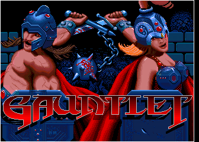
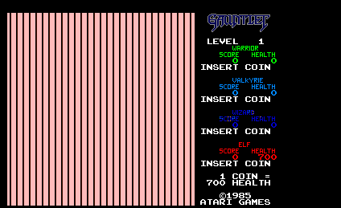
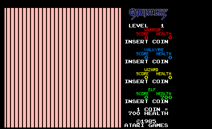
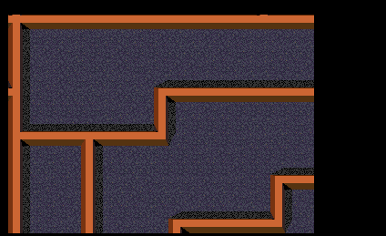
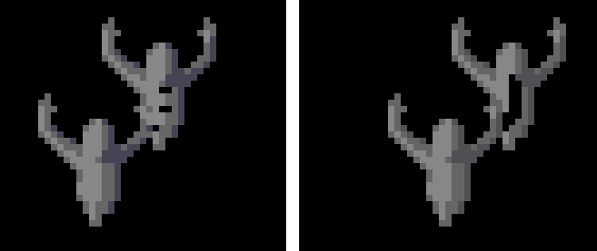

# *WIP* - Work In Progress - *WIP*

# Atari Gauntlet FPGA Arcade

## About
These are the early stages of an attempt at an FPGA implementation of Atari's arcade game "Gauntlet" from 1985, based on the SP-284 schematic circuit diagram.

There is no code published yet as this is in a non functional "work in progress" state at this time.

## Hardware
None yet, this is purely at the simulation stage using Xilinx ISIM. All screen shots are generated from test bench output of what the video signal would look like if it was displayed on a monitor. The testbench dumps the output video values for each frame in a .ppm (portable pixmap) text file which can then be directly viewed by a suitable viewer (eg FastStone Image Viewer).  

The .ppm file format is very simple, one line with the pixmap magic value P3, next line is the X and Y resolution and max number of colors, followed by hopefully at least X*Y lines of RGB color triplets like so:
<pre>
P3
336 240 15
15 15 15
 0  0  0
15 15 15
12 11 15
10  9 15
</pre>
Currently only the Video section of the arcade is being implemented and debugged (sheets 8 though 16 in the schematic). Because there is no CPU to run the game, for simulation purposes, the video RAMs are initialized with data dumped from MAME so as to produce the relevant game screens.

## Platform Information

The following collection of information serves as notes used during debugging.  

### Video Output

The game has a resolution of 336x240 pixels.

The video output is generated in `RGBI` format before being converted to `RGB` (sheet 16) so the total number of colors are 4 bits per color, plus a common 4 bit intensity for all colors for a total of 16 bits or 65536 colors.

The game uses the typical three layer video layout, `Text`, `Sprites` and `Background`. The schematic refers to the text layer as `AL` which seems to stand for Alphanumerics, the sprite layer is `MO` for Motion Objects and the background is `PF` for Play Field.

### Video Memory Layout

The video uses a total of 24KB RAM for the VRAM (video RAM)  organized as three sections of 4Kb x 16 bits:
<pre>
Playfield
PF  900000-901FFF   R/W   xxxxxxxx xxxxxxxx   Playfield RAM (64x64 tiles)
                    R/W   x------- --------      (Horizontal flip)
                    R/W   -xxx---- --------      (Palette select)
                    R/W   ----xxxx xxxxxxxx      (Tile index)  

Motion Objects
MO  902000-9027FF   R/W   xxxxxxxx xxxxxxxx   Motion object RAM TILE
                    R/W   -xxxxxxx xxxxxxxx      (Tile index)  
MO  902800-902FFF   R/W   xxxxxxxx xxxxxxxx   Motion object RAM XPOS
                    R/W   xxxxxxxx x-------      (X position)
                    R/W   -------- ----xxxx      (Palette select)  
MO  903000-9037FF   R/W   xxxxxxxx xxxxxxxx   Motion object RAM YPOS
                    R/W   xxxxxxxx x-------      (Y position)
                    R/W   -------- -x------      (Horizontal flip)
                    R/W   -------- --xxx---      (Number of X tiles - 1)
                    R/W   -------- -----xxx      (Number of Y tiles - 1)  
MO  903800-903FFF   R/W   xxxxxxxx xxxxxxxx   Motion object RAM LINK
                    R/W   ------xx xxxxxxxx      (Link to next object)  
Spare Video
SP  904000-904FFF   R/W   xxxxxxxx xxxxxxxx   Spare video RAM  

Alphanumerics
AL  905000-905ED3   R/W   xxxxxxxx xxxxxxxx   Alphanumerics RAM (64x32 tiles)
                    R/W   x------- --------      (Opaque/transparent)
                    R/W   -xxxxx-- --------      (Palette select)
                    R/W   ------xx xxxxxxxx      (Tile index)
    905F6E          R/W   xxxxxxxx x-----xx   Playfield Y scroll/tile bank select
                    R/W   xxxxxxxx x-------      (Playfield Y scroll)
                    R/W   -------- ------xx      (Playfield tile bank select)
AL  905F80-905FBF   R/W   xxxxxxxx xxxxxxxx  
AL  905FC0-905FFF   R/W   xxxxxxxx xxxxxxxx   
</pre>
Additionally 2KB RAM are used for the CRAM (color palettes):
<pre>
AL  910000-9101FF   R/W   xxxxxxxx xxxxxxxx   Alphanumerics palette RAM (256 entries)
MO  910200-9103FF   R/W   xxxxxxxx xxxxxxxx   Motion object palette RAM (256 entries)
PL  910400-9105FF   R/W   xxxxxxxx xxxxxxxx   Playfield palette RAM (256 entries)
EX  910600-9107FF   R/W   xxxxxxxx xxxxxxxx   Extra palette RAM (256 entries)
                    R/W   xxxx---- --------      (Intensity)
                    R/W   ----xxxx --------      (Red)
                    R/W   -------- xxxx----      (Green)
                    R/W   -------- ----xxxx      (Blue)
</pre>
Tables above borrowed from MAME source code.

There are 42 text lines across and 30 down, each text character requires a word  
Top line starts at 905000 - 905053, remaining 22 words not visible on screen  
Next line starts at 905080 - 9050D3, remaining 22 words not visible on screen  
etc...  
Bottom line starts at 905E80 - 905ED3, remaining 22 words not visible on screen  

### Special Memory Locations

There are two special memory locations at 930000 and 905F6E that control overall MO and PF horizontal and vertical offset (scroll)

- 930000 = PF and MO horizontal scroll. Any write to range 930XXX will in fact work. The bottom 9 bits of the `WORD` written to 930000 will be latched by signal `/HSCRLD` into a 9 bit register formed by chips `9S` `6M` `7M` as well as latched into the internal register of custom chip `12K`, the `PFHS` (play field horizontal scroller). At game startup this is initialized to 0005. Scroll values from 0 to max value 1FF scrolls the playfield left.

- 905F6E = PF and MO vertical scroll. Increasing values scroll playfield up. This memory location is scanned each video frame and the top 9 bits are loaded into presettable counters `5J`,`5F`,`4F` when both `/VSYNC` and `/PFHST` are active (start of each video frame). The counters counts up from that value for each horizontal line. This pushes an offset into VPOS via the adders `5D`, `5E`. Lowest 2 bits are also loaded into a counter at each start of frame and count up modulo 4 into a 2:4 decoder which selects graphic ROM chip selects `GCS0`..`GCS3`  

### Sprite Format  
Sprites are stored at memory range 902000-903FFF. A single sprite is defined by four words: a tile, xpos, ypos and link value stored at the same offset in four different memory regions (some additional attributes are also stored, see detailed memory map above).

The sprites form a linked list via the LINK memory region 903800-903FFF

The link to the next sprite is obtained by doubling the current LINK offset and adding it to LINK memory base 903800.

For example at game startup the initial screen has the sprite link list shown below based on initial sprite offset 0046. Doubling the offset, we get 8C and adding it to LINK base memory 903800 we get 90388C, then as per the table below each memory has a LINK offset pointing to the next sprite LINK address. Note that many tiles in the link list do not contain a visible sprite (value 0800) yet they are still part of the linked list, simply waiting for a valit sprite value to be stored at those addresses and the sprite then becomes visible.
<pre>
Memory 90388C 90389C 9038AA 9038B8 903978 90397A 90397C 90398C 903A1C 903A2C 903C38 903C3A 903C3C 903C7A 903D18 903D1A
Sprite   097E   0990   08FC   0AFC   1D42   1D48   1D52   1648   096C   0990   0800   0800   0800   09AB   0800   0800  
Memory 903D1C 903D1E 903D20 903D58 903D5A 903D5C 903D5E 903D60 903D7A 903D98 903D9A 903D9C 903D9E 903DA0 903DD8 903DDA
Sprite   0800   0800   0800   0800   0800   0800   0800   0800   0800   0800   0800   0800   0800   0800   0800   0800  
Memory 903DDC 903DDE 903DE0 903E18 903E1A 903E1C 903E1E 903E20 903E58 903E5A 903E5C 903E5E 903E60 903E98 903E9A 903E9C
Sprite   0800   0800   0800   0800   0800   0800   0800   0800   0800  0800    0800   0800   0800   0800   0800   0800  
Memory 903E9E 903EA0 903ED8 903EDA 903EDC 903EDE 903EE0 903F18 903F1A 903F1C 903F1E 903F20 903F58 903F5A 903F5C 903F5E
Sprite   0800   0800   0800   0800   0800   0800   0800   0800   0800   0800   0800   0800   0800   0800   0800   0800  
Memory 903F60 903F98 903F9A 903F9C 903F9E 903FA0 903FD8 903FDA 903FDC 903FDE 903FE0 903FFA 903800
Sprite   0800   0800   0800   0800   0800   0800   0800   0800   0800   0800   0800   09E1   0000
</pre>

The sprite link list does not appear to be circular, so the LINK register must be initialized with the offset of the first link list item at the start of each horizontal scanline. The first memory location (index=0) does not contain a LINK to a valid sprite so once that memory location is reached, the LINK register remains zeroed.

Memory region 905F80-905FFF controls sprite visibility as follows  
905F80 enables sprites on   top  8 lines of screen 328..335  
905F82 enables sprites on  next  8 lines of screen 320..327  
...  
905FB8 enables sprites on  next  8 lines of screen 8..15  
905FBA enables sprites on bottom 8 lines of screen 0..7  

To be determined  
905FC0  
..  
905FFE  

The region is scanned once at the start of each frame during the first 8 scan lines.

At each location, the word's top 6 bits seem to be unused and the word's bottom 10 bits (when doubled) is a pointer to a sprite offset (typically the first sprite in a linked list).

So for every word in the memory range 905F80-905FBA, if the word's bottom 10 bits point to a valid sprite, then if that sprite or any other sprites linked from it have y coordinates that fall within the screen range of 8 lines covered by that memory location, those portions of those sprites are visible on those lines on the screen.

From simulation, this memory range is scanned during each horizontal line, data from MO VRAM ends up on VRD then loaded on LINK register latch `8F`, `8J` on rising `RCLK` when `/LINK` signal is low.

## It's Alive!!!
After the initial translation of the schematic to RTL, the simulation produces the frame of video on the left but it's not the expected output as we can see on the right from MAME:  
 

### Debugging the alphanumerics:
The top right corner under the Gauntlet logo, where the first text line should read "LEVEL   1", the L begins to be drawn but instead of drawing an L shape the display shows the 2 pixels of the top of the L replicated for all 8 lines. All text characters exhibit the same behaviour.

Pixel data goes to GPC `APIX1`, `APIX0` from shifters `7P`, `7N` fed by `ROM 6P` driven by `VRD` bus through latches `4P`, `7R` on `4H` rising clock.  
`ROM 6P` address is `VRD9..0` registered, plus unregistered signals `4V`, `2V`, `1V`, `/4H`, address changes every 4 cycles.

<pre>
start of line 48 at 3570us  
258x48 at 3612.935 addr is L=[04C0, 04C1], E=[450, 451], V=[560, 561], E=[0450, 0451], L=[04C0, 04C1]...  
258x49 at 3676.775 addr  
258x50 at 3740.615 addr  
258x51 at 3804.455 addr  
258x52 at 3868.295 addr  
258x53 at 3932.135 addr  
258x54 at 3995.975 addr  
258x50 at 4059.815 addr  
</pre>
Turns out `4V`, `2V`, `1V` were not driven so `ROM 6P` was not being addressed properly so was not outputting enough data to form proper characters. Connecting the additional signal properly produces a much more recognizable picture:  

Additionally GPC `I_D` bus connect order was wrong, so colors were also reversed. Fixing that shows colors in correct order:  

### Playfield debugging
The playfield shows pink stripes instead of the expected maze. Forcing the AL ROMs to return zero, makes the text on the right of the screen disappear. This reveals additional playfield that would normally be hidden by the text. Since AL was fixed earlier, it will be left disabled while troubleshooting the PF issue.

Adding debug code to the simulator to dump selected busses to a log file and debugging the GP bus address (ROM addresses), data out of ROMs and into SLAGS, reveals several mistakes such as unconnected signals, SLAGS selectors S0 S1 to the shifters were reversed, etc, so progressively the playfield becomes more and more visible.  
  
  
  
  

### CRAM Debugging
PF is now looking much better but the colors are wrong. Suspecting CRAM, palette indexing.

CRAM is addressed by the 10 bit bus CRA from GPC. The top two bits of address selects CPAL as follows:

- 0 = AL
- 1 = MO
- 2 = PF
- 3 = Extra

Top two bits have value of 2 so they correctly access PF CPAL, therefore lower byte is an index into the PF CPAL.

From MAME it is apparent that for the initial screen, the game only uses CPAL indexes 280-29F for PF as below. This CPAL section shows what each index value is used for, X is don't care/unused, F is floor tile, the rest are wall pieces.
<pre>
280: 0000 6631 9631 C631 F631 F643 F654 F876 -- X X X X X X F X
288: 8333 7223 A324 F334 C334 C445 E445 F445 -- wallshade F F F F F F F
290: F410 F010 F110 F322 B520 4531 F531 F731 -- X X X wallright X X walldown wallleft
298: FC63 F840 FD84 F335 F246 F158 F26A F37B -- walltop X X X X X X X
</pre>

Examination in the simulator shows the following discrepancies:

- wallshade color index expected 288 observed 257  
- wallright color index expected 293 observed 24C  
- walldown  color index expected 296 observed 249  
- wallleft  color index expected 297 observed 248  
- walltop   color index expected 298 observed 247  

It appears that the pattern is the original value lower byte + x20 xor 0xff. This incorrect data comes from the GPC (Graphic Priority Control) chip `12M` which in turn receives it from PFHS (Play Field Horizontal Scroll) chip `12K`. Since may of the custom chips in this schematic are based on earlier versions implemented with discrete components, checking schematic SP-277 for the Atari System 1 where this PFHS was based from, shows there is a small 64 bit 74F189 RAM chip inside the PFHS. The mistake made was to assume that the data that goes into the RAM chip comes out exactly the same, but upon reading the RAM datasheet it turns out the data coming out of RAM is the **complement** of the data going in! After inverting the outputs from the PFHS RAM chip the PF now shows correct colors:  

### Debugging Motion Objects
Sprites do not show on screen at all. When sprites exist on the screen, it seems `/VMATCH` asserts during sprite presence but, horizontal match doesn't so the `MATCH` signal is never asserted. It seems the `6S` F/F VHDL implementation is wrong, something with having both set and presets, output `6S9` is never preset by `/VERTDL`, also `6S6` output is **inverted**, not just straight through. After inverting output `6S6` and fixed async preset of F/F `6S` sprites now show (corrupted) on top of screen and they seem to repeat instead of just showing once. Further research shows that `MOHLB` (Motion Object Horizontal Line Buffer) had miscellaneous logic issues that needed correcting.

### More CRAM debugging
Just when the colors appeared to be OK, it became apparent that sprites like 0863 (ghost) show up with wrong colors. Investigating why an incorrect color palette is selected leads to discovering that CRA5, CRA7 outputs from 8U page 15 are stuck low because they were not driven (were left unconnected). After connecting them to the appropriate drivers the colors are not much better. Below left is what it looked like before, right is what it looks like after the fix.  

## Outstanding Bugs
These bugs may be "outstanding" but they don't deserve a standing ovation or a parade. They need to be unceremoniously squashed.

### Debugging Motion Objects Overlap
Problem with sprite overlay, when sprites (like the ghosts) are overlapping, some minor corruption is visible, for example the shadow of the top ghost's arm is not obscuring the ghost underneath. Suspect GPC (Graphic Priority Control) problem.

Left: how it looks, Right: how it should look.  

Sprite tuples for two ghosts to replicate issue  
GH1  GH2  
0890 0890  
0202 0002  
F392 F392  
0001 0000  

In ISIM place value on bus\_vbd, pulse i\_hs, see debug commands below.

At time offset 1918690ns line 7 of ghost sprite  
<pre>
Observed
CRAM ADDR   0297 0297 0297 0128 0126 0297 0217 0128 0126 0217 0217 0217 0217 0217 0217 0217 0217 0217 0217
CRAM DATA   F731 F731 F731 8FFF 6FFF F731 8731 8FFF 6FFF 8731 8731 8731 8731 8731 8731 8731 8731 8731 8731 8FFF 5EEF 8731 8731 8731 5EEF 8731 8731 8731 F731 ...  
Expected
CRAM ADDR   0297 0297 0297 0128 0126 0297 0217 0217 0217 0217 0217 0217 0217 0217 0217 0217 0217 0217 0217
CRAM DATA   F731 F731 F731 8FFF 6FFF F731 8731 8731 8731 8731 8731 8731 8731 8731 8731 8731 8731 8731 8731 8FFF 5EEF 8731 8731 8731 5EEF 8731 8731 8731 F731 ...  
</pre>
CRAM address comes from 12M GPC Graphic Priority Control output  
To exclude PF with following command:  
isim force add {/tb\_fpga\_gauntlet/uut/gauntlet\_inst/video\_inst/p\_12M/i\_p} 80 -radix hex  

I\_M input takes values FF FF FF FF D7 D9 FF DE D7 D9 DE DE DE DE DE DE DE DE DE DE D7 DA DE  
I\_M comes from MPX output of MO Horizontal Line Buffer so problem might be with MOHLB then.  

### Debugging Motion Objects LINK register
Sprites only show when sprite LINK value at offset 0 (memory 903800) points to a valid sprite, otherwise no sprites show at all.

Following the flow of data from Video RAM we see:  
<pre>
                                       Ypos 15..7
                                       HFlip 6
                      Xpos 15..7       XTiles 5..3
Sprite bits 14..0     Palette 3..0     YTiles 2..0      Link 9..0 (offset x2 + 902000)  
90208C=097E Lady      90288C=2E01      90308C=E812      90388C=004E
90209C=0999 Chest     90289C=6E01      90309C=E812      903978=00BE
90218C=1648 Hero      90298C=2E0F      90318C=C812      90397C=00C6
90221C=096C Food      902A1C=6E01      90321C=B812  
Must latch in         Must latch in    Must latch in    Must latch in
3C3K on rising        4N 3N on rising  5C 5K on rising  8F 8J on rising
PICTDL                HORZDL           VERTDL           /LINK  
The latch signals come from MC1, MC0 decoded by 1:4 active low selector 8T
3 /LINK
2 VERTDL
1 HORZDL
0 PICTDL  
MC1, MC0 are generated by 1H, 2H, 4H, MATCH  
VAS_star
3 CPU
2 AL
1 MO
0 PF
</pre>

The problem as observed from simulation is this:
If the word at 903800 contains 0400 (as per MAME simulation of game), the LINK register is loaded with the bottom 10 bits (all zero) and therefore when it is used as a pointer into the MO VRAM, it points to offset 0 (memory 903800) so it is loaded again with zero and so on. So the LINK register is always zeroed and never finds any sprites.

If however we initialize word at 903800 with a value that points to an actual sprite's offset, then that value is loaded into the LINK register, then the LINK register is used as an index into the MO VRAM LINK area to retrieve the next word which is used as an index and so on.

As a proof test, in ISE simulator, we load VRAM with an exact dump of the memory from MAME, then we change location 903800 from 0400 to 0046 (so it points to the first sprite offset) then the simulation indeed proceeds to display all sprites on the screen as expected.

**Find out how LINK register is supposed to work.**

## Debugging Commands

In MAME debug mode use ***w@930000=0005*** to write new horizontal scroll offsets, or ***w@930000=00BC*** for vertical scroll offsets

In ISIM we can place a value on `VBD` then pulse `/HSCRLD` with the following commands. This could also be done in a testbench but then we have to relaunch (recompile) the simulation every time we try a new value.

**restart;  
isim force add {/tb\_fpga\_gauntlet/uut/gauntlet\_inst/video\_inst/bus\_VBD} BC -radix hex -time 3 us -cancel 6 us;  
isim force add {/tb\_fpga\_gauntlet/uut/gauntlet\_inst/video\_inst/s\_HSCRLDn} 0 -radix bin -time 4 us -cancel 5 us;  
run 18ms;**  

MAME debug commands to follow the sprite link list from an initial index and dump the values. Set temp0 to initial index of interest then repeat the next two command as many times as necessary

**temp0=0046**  

**temp1=w@(902000+temp0\*2); temp2=w@(902800+temp0\*2); temp3=w@(903000+temp0\*2); temp4=w@(903800+temp0\*2); temp0=w@(903800+temp0\*2)&3ff**  

**printf "\n%04X TILE=%04X\n%04X XPOS=%d, PSEL=%d\n%04X YPOS=%d, HSIZ=%d, VSIZ=%d\n%04X LINK=%04X (%04X)",temp1,temp1&7fff,temp2,temp2>>7,temp2&15,temp3,temp3>>7,(temp3>>3)&7,temp3&7,temp4,temp4&3ff,903800+(temp4&3ff)\*2**

### Misc
Flow of data with no CPU active should be
<pre>
  +-->[VRAMS]--vrd bus-->[VROM]--ab bus-->[SLAGS]--MOSR/PFSR bus-->[PFHS]--pfx bus-->[GPC]--cra bus-->[CRAMS]--RGBI out bus-->[Video Out]
  |
  |
  +--vra--+-(3 --) [ma12..1 CPU address]
          |-(2 AL) [HV counters]<------------------------------- [SYNGEN]<--------------[CLOCK]
          |-(1 MO) [mc1,mc0,lnk9..0 from vrd on /link signal]
          +-(0 PF) [pfv from counters, pfh from PFHS]
              ^
              |
              +---[VS1* VS0* selectors from 7U PROM]
</pre>

There are four cycles counted by `VS1*`, `VS0*` which select RAMs  

- 0 = PF
- 1 = MO
- 2 = AL
- 3 = NONE  

When no RAMs are selected the bus `VRD` floats  

Bus `VRD` can be driven by:  
		CPU via `9E`-`10E` into `VBD` when `BW//R` is 1 and `VBUS` is 0 then `VBUS` into `VRD` via `10F`, `9F` when `/VRAMWE` is 0  
		RAMs when any of them is selected via a `/MOHI` `/MOLO` `/ALHI` `/ALLO` `/PFHI` `/PFLO` low signal and `/VRAMWE` is 1  

`VRD` drives  
		`VBD` via `10J` `9J` when `/VRAM` is 0 and `BW//R` is 0  
		RAMs when any of them is selected via a `/MOHI` `/MOLO` `/ALHI` `/ALLO` `/PFHI` `/PFLO` low signal and `/VRAMWE` is 0  

`/VBUS` active enables one of `/VRAM` `/CRAM` `/HSCRLD` based on `A17` `A16`

Minimum VRAM contents to display one sprite  
900000-905FFF zeroed out then  
w@90208C=097E  
w@90288C=2E01  
w@90308C=E812  
w@90388C=AC00  

w@905F8A=0046  
w@905F88=0046  
w@905F86=0046  

910000-9107FF zeroed out then:  
Color palette loaded at 910220-91023F  

To Be Continued
