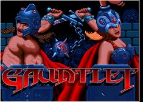
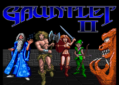
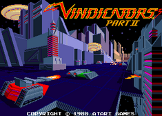

# Atari Gauntlet FPGA Arcade
by Alex (https://github.com/d18c7db)..

## About
This is an FPGA implementation of Atari's arcade game "Gauntlet" from 1985, based on the SP-284 schematic circuit diagram.  

It successfully runs all three games Gauntlet, Gauntlet II and Vindicators II that run on the original arcade. All sounds are implemeted, Pokey, YM2151 and TMS5220 Voice Synthesis Processor (see my [TMS5220 repository](https://github.com/d18c7db/TMS5220_FPGA) for more details on the VSP).  

  

The videos below show some of the problems encountered earlier in the development.  

Youtube video of Gauntlet:  

Additional video of FPGA running Gauntlet II ROMs  

The implementation is functional right now, can coin up and start game, known problems are as follows:

* Game EPROM is implemented as RAM so game settings are lost on power off.

## MiSTer Install
The core <b>must have</b> a [SDRAM expansion](https://github.com/MiSTer-devel/Main_MiSTer/wiki/SDRAM-Board) daughterboard in order to play correctly on a [MiSTer](https://github.com/MiSTer-devel/Main_MiSTer/wiki) FPGA board. This applies to all three games namely Gauntlet, Gauntlet II and Vindicators part II. Without the SDRAM, the core will still run and display some text but will be missing the sprites and background textures (graphics).  

This repository follows the standard folder structure for distributing MiSTer files.  

ROMs are not included so in order to use this arcade, you need to provide the correct game ROM.  

*WARNING:* In order to play Vindicators part 2, you must run the python script "descramble_2J.py 136059-1184.2j 136059-1184.des.2j" then copy the binary output file 136059-1184.des.2j into the zip file with the original ROMs.  

To simplify the process .mra files are provided in the releases folder, that specify the required ROMs with checksums. The .zip filename refers to the corresponding ROM file of the MAME project.

Please refer to https://github.com/MiSTer-devel/Main_MiSTer/wiki/Arcade-Roms for information on how to setup and use the environment.

Quickreference for folders and file placement:

/_Arcade/<game name>.mra  
/_Arcade/cores/<game name>.rbf  
/_Arcade/mame/<mame rom>.zip  

Gauntlet currently supports up to 4 joysticks for 4 players. MAME keys layout is available for (up, down, left, right, fire, start/magic, coin) as follows: player 1 (up, down left, right, left ctrl, left alt, 5), player 2 (R, F, D, G, A, S, 6), player 3 (I, K, J, L, right ctrl, right shift) and player 4 on numeric pad (num 8, num 2, num 4, num 6, num 0, num .)  

The tank controls used in Vindicators are mapped to one joystick. For Vindicators keyboard is supported, 5,6 are coin, 1,2 start game, QWERASDF and YUIOHJKL controls for player 1 and 2 respectively. Joysticks are connected but may need remapping.  

## Building

### Pipistrello
On a [Pipistrello](http://pipistrello.saanlima.com/index.php?title=Welcome_to_Pipistrello) FPGA board, a [SRAM expansion](https://oshpark.com/profiles/d18c7db) daughterboard is needed.  

The project files are under `/pipistrello` and are setup for Xilinx ISE 14.7  

### MiSTer

The project files are under folder `/MiSTer` and are setup for Quartus 17  
